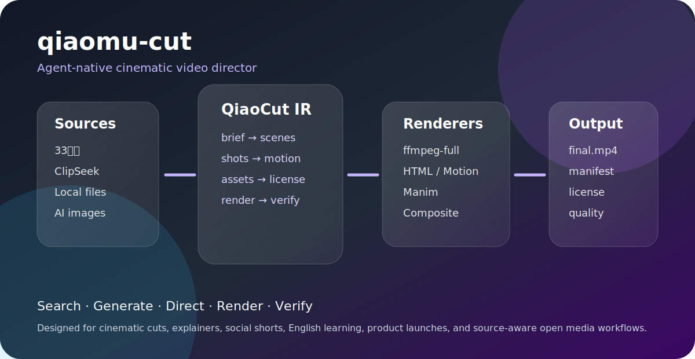

# qiaomu-cut

> 你只说一句“我要什么视频”，它把素材、分镜、字幕、转场、动效、渲染和质检组织成一个可复现的视频工程。
> Say what video you want; qiaomu-cut turns it into a source-aware, renderer-ready, verifiable video project.

[](LICENSE)
[](SKILL.md)



## 为什么值得用

普通 AI 会给你一段剪辑建议，真正开剪时还要你自己找素材、查版权、装 ffmpeg、写字幕、调转场、验编码。

qiaomu-cut 把这些拆成一个可复用的视频导演系统：它先生成 `QiaoCut IR`，再按环境路由到 33台词、ClipSeek/Pexels/Pixabay、本地素材、AI 图片生成、HTML/Manim/PPT 等可用引擎，最终由 ffmpeg-full 合成。

v0.3 已真实实现的是：项目时间线渲染、图片/视频取景、有限 Ken Burns 运镜、三层双语 ASS、macOS 旁白、确定性程序音乐、原声混合/ducking、`preview` / `standard` / `final` 三档渲染、分层验收和项目内内容寻址缓存。HTML 视频捕获、Manim/PPT 直出、复杂遮罩、速度渐变和完整转场库目前是工作流接口与扩展方向，不冒充已经全部内置。

它不是承诺“魔法般永远一键完美”，而是把专业视频制作流程变成 agent 能执行、能验证、能继续扩展的工程。

## 一行安装

```bash
npx skills add joeseesun/qiaomu-cut-skill
```

本地开发或手动安装：

```bash
mkdir -p ~/.agents/skills
cp -R qiaomu-cut ~/.agents/skills/qiaomu-cut
```

验证：

```bash
node ~/.agents/skills/qiaomu-cut/scripts/qcut.js doctor --json
```

## 你可以这样说

- “搜索几句电影里的脏话台词，混剪成英语学习视频。”
- “用免费素材做一个 60 秒挖掘机英语启蒙视频。”
- “介绍乔布斯，做一个电影感人物短片，有时间线和档案照片。”
- “把这个口播视频剪成小红书风格，强字幕、B-roll、卡点转场。”
- “用 3Blue1Brown 风格解释 Transformer attention。”
- “给我的网站做一个产品发布视频，网页动效融入剪辑。”

## 它会做什么

1. 把一句话需求变成 `QiaoCut IR`：时长、比例、受众、风格、分镜、素材策略、渲染器。
2. 搜索或整理素材：33台词、ClipSeek、Pexels/Pixabay 原站、本地文件、AI 生成图、网页/信息源。
3. 设计专业镜头：推拉摇移、匹配剪辑、J/L cut、遮罩、字幕跟随、标题卡、动态图形。
4. 选择渲染引擎：ffmpeg-full、HTML/HyperFrames-style、Motion/CSS/SVG、Manim、PPT/slide、composite。
5. 先用 `preview` 快速迭代，内容锁定后再用 `standard` 或 `final` 渲染。
6. 输出与档位匹配的成片、contact sheet、缓存命中、阶段耗时和质检信息。

## 前置条件

- [ ] Node.js 18+：`node --version`
- [ ] macOS 推荐 Homebrew：`brew --version`
- [ ] ffmpeg-full：`scripts/bootstrap_macos.sh --check`
- [ ] 需要影视台词素材时，本机已安装并登录 33台词 App，并另行安装获得授权的 `33tc` CLI adapter；用 `which 33tc` 验证，或设置 `QIAOMU_33TC_CLI`。
- [ ] 需要发布到 GitHub 时，GitHub CLI 已登录：`gh auth status`
- [ ] 需要 AI 图片生成时，当前 agent 环境提供图片生成工具。

安装 ffmpeg-full：

```bash
~/.agents/skills/qiaomu-cut/scripts/bootstrap_macos.sh --install
```

这个脚本不会强制覆盖系统 `ffmpeg`。运行时优先使用：

```text
QIAOMU_FFMPEG
/opt/homebrew/opt/ffmpeg-full/bin/ffmpeg
/usr/local/opt/ffmpeg-full/bin/ffmpeg
ffmpeg
```

## CLI 示例

检查本机能力：

```bash
node scripts/qcut.js doctor --json
```

通过已登录的本机 33台词 App 搜索台词：

```bash
node scripts/qcut.js 33tc search "dig deeper" --limit 8 --json
```

`qcut 33tc` 原样透传内置的 `search`、`pick`、`cut`、`tasks`、`download`、`me` 子命令。`pick` 和 `cut` 会创建剪辑任务，可能消耗账号积分；先核对影片、时间范围和输出目录，只有明确确认后才加 `--yes`。skill 不会替你静默确认。

搜索 ClipSeek 免费素材候选：

```bash
node scripts/qcut.js clipseek "挖掘机" --type video --limit 5 --json
```

生成剪辑计划：

```bash
node scripts/qcut.js plan "做一个 60 秒挖掘机英语启蒙视频" --workflow stock-story --json
```

创建一个可继续制作的视频工程：

```bash
node scripts/qcut.js scaffold ./excavator-video --brief "做一个 60 秒挖掘机英语启蒙视频" --json
```

填好项目内 `timeline.json` 后，先执行快速预览：

```bash
node scripts/qcut.js render ./excavator-video --profile preview --json
```

确认内容、字幕、节奏和构图后再生成正式成片：

```bash
node scripts/qcut.js render ./excavator-video --profile final --json
```

`render` 默认读取 `<project-dir>/timeline.json`；也可用 `--timeline alternate-timeline.json`。为兼容 v0.2，省略 `--profile` 仍等价于 `--profile final`，不会悄悄降低既有项目的输出质量。时间线里的素材、字幕、旁白和输出路径必须是项目相对路径，渲染器会同时检查词法路径与软链接物理路径。已有输出默认保留；确认目标均为可替换的生成物后，才加 `--force`。调试时可加 `--keep-build` 保留本次唯一构建目录。

### 三档性能工作流

| 档位 | 默认渲染策略 | 默认校验 | 适合场景 |
|---|---|---|---|
| `preview` | 长边不超过 960、最高 24 fps、`ultrafast`、单遍响度；不生成 contact sheet | `basic`：流、尺寸、帧率、时长、像素格式、空文件 | 反复调整素材、字幕、节奏和构图 |
| `standard` | 长边不超过 1280、最高 30 fps、`veryfast`、单遍响度；最多 8 帧 contact sheet | `standard`：`basic` + 最终响度/峰值 + 静音扫描 | 内部审阅、日常快速交付 |
| `final` | timeline 原始尺寸/帧率和既定编码参数、两遍响度、完整 contact sheet | `full`：`standard` + 全片黑场扫描 | 公开发布、归档、客户终稿 |

只有 `profile=final`、`validation=full`、技术校验通过，且字幕字体不是 `system-unverified` 时，渲染报告的 `releaseReady` 才会是 `true`。`--validation basic|standard|full` 可以用于诊断，但一般不要把较弱校验与正式发布混用。

非 `final` 档会使用独立文件名，例如 `renders/final.preview.mp4`、`renders/final.standard.mp4`，对应字幕和报告也带档位后缀，不会覆盖正式成片。`--output` 可指定新的项目相对输出路径。

### 项目内缓存

默认缓存位于 `<project>/.qiaocut/cache/`，复用未变化的镜头片段、macOS TTS 和已烧录字幕的画面；缓存键包含素材指纹、时间线参数、渲染档位和 ffmpeg 版本。渲染报告会记录 `cache.hits`、`cache.misses` 和逐阶段 `timings`。排查缓存问题时可临时使用 `--no-cache`，平时不要主动关闭缓存。

同一台开发机上的 60 秒 DIG 双语样片实测如下，结果仅用于比较档位和冷热缓存，不是跨机器速度承诺：

| 场景 | 耗时 |
|---|---:|
| v0.2 原始 `final` | 71.6 秒 |
| v0.3 `preview` 冷缓存 | 27.7 秒 |
| v0.3 `preview` 暖缓存 | 3.3–4.1 秒 |
| v0.3 `standard` 冷缓存（TTS 已暖） | 27.1 秒 |
| v0.3 `standard` 暖缓存 | 4.1 秒 |
| v0.3 `final/full` 冷缓存（TTS 已暖） | 65.6 秒 |
| v0.3 `final/full` 暖缓存 | 8.5 秒 |

`qcut render` 已在内部执行与档位对应的技术校验并写入 render report。渲染后不要机械地再运行一次 `qcut verify`；该命令保留给外部生成、移动后或单独收到的视频文件。

生成 ASS 字幕和 HTML 场景：

```bash
node scripts/qcut.js ass captions.json --output subtitles.ass
node scripts/qcut.js html-scene qiaocut-ir.json --scene s01 --output scenes/s01.html
```

生成素材授权报告：

```bash
node scripts/qcut.js license assets-manifest.json --output license-report.md
```

查看工作流：

```bash
node scripts/qcut.js workflow list
node scripts/qcut.js workflow show english-mix --json
```

验证外部生成、移动后或单独收到的视频：

```bash
node scripts/qcut.js verify ./final.mp4 --json
```

## 双语字幕策略

英语学习和跨语言视频默认使用三层信息架构：

1. 主字幕：英文原句或主语言，承担听读训练。
2. 中文层：自然、简洁的中文字幕，不做生硬逐词直译。
3. 注释层：词义、语境、音标或素材来源，放在顶部安全区。

三层不是所有视频的硬性模板。中文人物片、无旁白氛围片等项目应按内容删减层级。最终要从 contact sheet 和关键帧人工检查字号、遮挡、安全区与译文语义。

有 `fontsDir` 时优先使用项目指定字体；没有时，渲染器会自动查找本机已安装的 Noto Sans CJK SC，并仅复制到项目私有的 `.qiaocut/cache/fonts/` 供本机渲染。skill、Git 仓库和发布包不会捆绑、上传或再分发本机字体。若项目必须跨机器复现，应由项目维护者自行选择具有再分发许可的字体并遵守其许可证。

## 样例输出

```json
{
  "schema": "qiaocut.ir.v0",
  "workflow": {
    "id": "stock-story",
    "title": "免费素材故事片"
  },
  "output": {
    "durationSeconds": 60,
    "aspect": "9:16",
    "deliverables": [
      "final.mp4",
      "qiaocut-ir.json",
      "assets-manifest.json",
      "license-report.md",
      "quality-report.json"
    ]
  },
  "gates": ["doctor", "source manifest", "license report", "profile-aware render verification"]
}
```

## 内置工作流

| 工作流 | 适合做什么 |
|---|---|
| `english-mix` | 电影台词、英语学习、俚语/脏话表达、原声复读 |
| `stock-story` | 免费素材科普、儿童启蒙、行业介绍、B-roll 故事 |
| `person-profile` | 人物介绍、企业家传记、历史人物、档案短片 |
| `explainer` | 数学/算法/科学解释，Manim/3Blue1Brown 风格 |
| `cinematic-short` | AI 视觉叙事、概念片、预告片、电影感短片 |
| `product-launch` | 网站/App/AI 工具发布视频，网页动效融入 |
| `social-short` | 抖音/小红书/TikTok 竖屏强节奏短视频 |
| `talking-head` | 口播精剪、访谈、播客切片、字幕和 B-roll |
| `data-story` | 数据报告、排行榜、趋势、图表动画 |
| `hybrid-studio` | 多素材源、多引擎、复杂客户级项目 |

更多细节见 [`references/workflows.md`](references/workflows.md)。

可执行时间线字段、双语字幕结构和渲染安全规则见 [`references/timeline-schema.md`](references/timeline-schema.md)。

## 素材源

- 33台词：影视台词搜索和片段工作流。公开 skill 只委托独立安装的 `33tc` adapter，不捆绑 App 私有协议；不打印 token、cookie、用户 ID 或签名地址。`pick` / `cut` 可能消耗积分，只有明确确认后才传 `--yes`。
- ClipSeek：免费素材搜索聚合。已实现只读搜索 adapter。
- Pexels / Pixabay：通过 ClipSeek 结果回到原站确认下载和许可。
- 本地文件：用户提供的素材优先，不覆盖原文件。
- AI 生成：封面、插画、背景、缺口 B-roll、SVG/网页视觉。
- 信息源：人物/公司/事件视频必须记录引用来源。

重要：ClipSeek 是发现入口，不是最终许可证明。公开视频必须记录原站 source page 和 license。

影视台词片段同样不因“能下载”而自动获得公开传播或商业使用权。33台词只复用本机已安装、已登录 App/CLI 的状态，skill 不上传登录凭据、不输出 token；此类片段默认按学习、评论、研究或用户已获授权的范围处理。AI 生成图片会在素材清单中标记为 `ai_generated`，不能伪装成实拍或档案照片。

## 渲染与验收边界

`qcut render` 负责把已经准备好的项目时间线合成为成片，并按档位生成 contact sheet、render report 和技术校验。它不是“任意素材一键必然完美”的承诺：事实准确性、影视素材权利、字幕语义、人物肖像、审美取舍和平台规则仍需针对具体项目复核。

建议交付门如下：

- `doctor` 通过，确认 ffmpeg-full 具备 ASS/字幕、overlay、drawtext 等能力；缺失时运行 `scripts/bootstrap_macos.sh --install`，由 Homebrew 自动下载安装，但不会强制替换系统 ffmpeg。
- 每个外部素材在 `assets-manifest.json` 中记录 provider、source page 和许可状态；ClipSeek 结果回原站核验。
- Skill 默认先执行 `preview`；确认内容与视觉后再执行一次 `final`。`standard` 用于不需要母版级编码但仍要响度、静音和 contact sheet 的日常交付。
- `render` 成功返回视频、可选 contact sheet 和 render report；报告明确列出 profile、validation、缓存和逐阶段耗时。
- `render` 已包含对应档位校验，不再重复调用独立 `verify`。`final/full` 继续检查响度/峰值、黑帧和静音，并人工抽看 contact sheet；`preview/basic` 通过不代表可以公开发布。

## 配套浏览器编辑器

自动生成后如需人工拖拽精修，可使用独立的开源项目 [乔木剪辑](https://github.com/joeseesun/qiaomu-cut)。它是浏览器端多轨编辑器；本仓库则是 agent 自动导演与 CLI Skill。两者职责分离，后续通过工程交换格式衔接，不把尚未实现的互导描述成现成功能。

## 致谢与参考

qiaomu-cut 借鉴这些公开项目的方法和思想，不复制其私有内容：

- [HyperFrames](https://hyperframes.heygen.com/)：HTML/CSS/JS 作为 agent-native 视频创作格式。
- [Motion](https://motion.dev/)：网页动效、时间线、SVG/HTML 动画。
- [Manim Community](https://www.manim.community/) 与 [3b1b/manim](https://github.com/3b1b/manim)：程序化解释动画。
- [Theatre.js](https://www.theatrejs.com/)：关键帧和 motion design 思路。
- [FFmpeg](https://ffmpeg.org/)：最终合成、编码和音视频处理。
- [ClipSeek](https://clipseek.ai/)：视频/照片/插画素材发现。

## Troubleshooting

| 问题 | 原因 | 解决 |
|---|---|---|
| `missing filter: subtitles` | 当前 ffmpeg 不是 full build | 运行 `scripts/bootstrap_macos.sh --install`，或设置 `QIAOMU_FFMPEG` |
| ClipSeek 搜索有结果但不能直接下载 | ClipSeek 返回的是原站页面 | 打开 `sourcePage`，在 Pexels/Pixabay 等原站确认下载和许可 |
| 33台词不可用 | 本机未安装 App、未登录或 `33tc` CLI 未链接 | 先打开 33台词 App 登录，再检查 `33tc search` |
| 生成视频没有声音 | 输入素材无音轨或混音计划未执行 | 先读本次 render report 的 `verification.audio`；仅外部视频才单独运行 `qcut verify` |
| README 发布检查失败 | YAML/占位符/缺少章节 | 运行 `python3 scripts/validate_skill.py .` 按报告修复 |

## 风险和边界

- 不删除、不覆盖用户原始素材。
- 不打印 token、cookie、账号配置。
- 不声称素材“可商用”，除非原站许可已记录。
- 不把 AI 生成素材伪装成真实拍摄素材。
- 不把计划当成已完成渲染；缺证据必须写 `missing evidence`。

## 平台与配置

| 能力 | macOS | Linux | Windows |
|---|---|---|---|
| ffmpeg 时间线渲染 | 已验证 | 代码可运行，依赖需手动安装，尚缺 clean-host 证明 | 当前未支持 |
| `macos-say` 旁白 | 已验证 | 不支持；改用已有录音 | 不支持；改用已有录音 |
| 33台词 App adapter | 需 App 登录 + 独立 `33tc` | 取决于 adapter | 取决于 adapter，尚未验证 |
| ffmpeg-full 自动安装 | Homebrew 已实现 | 尚未自动化 | 尚未自动化 |

| 变量 | 必需 | 说明 |
|---|---:|---|
| `QIAOMU_FFMPEG` | 否 | 指定带 libass/loudnorm/sidechaincompress/libx264 的 ffmpeg |
| `QIAOMU_FFPROBE` | 否 | 指定与 ffmpeg 配套的 ffprobe |
| `QIAOMU_33TC_CLI` | 33台词工作流可选 | 指向独立安装、获得授权的 33tc adapter；否则从 `PATH` 查找 |

`missing evidence`：`qiaomu-cut-skill` 公开仓库发布与 `npx skills add` clean install 尚需在 GitHub 身份恢复后验证；未找到 33台词公开 API 文档，因此公开包没有宣称“只装 App 即零额外配置”；与浏览器编辑器的工程互导仍是后续接口。

<!-- qiaomu-profile:start -->
## 关于向阳乔木

向阳乔木（乔向阳 / Joe）是一位实践型 AI 产品与内容创作者，长期把前沿 AI 变化转译成可复用的工作流、产品判断、AI 编程实践、AI 搜索实践和 GEO/AI 营销方法。

- 个人网站: https://qiaomu.ai
- 博客: https://blog.qiaomu.ai
- X: https://x.com/vista8
- GitHub: https://github.com/joeseesun/
- 微信公众号: 向阳乔木推荐看

### 支持与关注

| 打赏支持 | 微信公众号 |
|---|---|
|  |  |
| 感谢支持乔木持续分享 AI 实践 | 扫码关注「向阳乔木推荐看」 |

<!-- qiaomu-profile:end -->

## License

MIT © 向阳乔木
X: <https://x.com/vista8>
GitHub: <https://github.com/joeseesun/>
